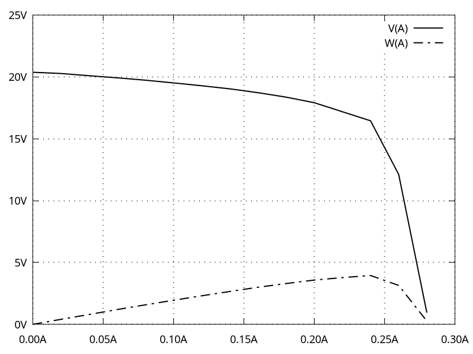

# fz35-cli
This tool will control XY-FZ35 / XY-FZ25 electronic loads remotely via serial commands. The project aims to be compatible to [makerspacelt/fz35-cli](https://github.com/makerspacelt/fz35-cli), but has been entirely rewritten in C.

## Compiling

Just clone this repository, change to the directory, and execute the make command. This assumes you already have a working gcc compiler on your system. On Debian you might have to install the build-essential package first.

```
git clone https://github.com/MalteP/fz35-cli.git
cd fz35-cli

make
```

## Usage

The cli tool needs at least two arguments: The serial port and one command. You might add as many commands as you like. Those will be executed in given order.

```
./fz35-cli port command [command] [...]
```

## Commands

| Command        | Description                                                       |
|----------------|-------------------------------------------------------------------|
| on             | Enable load                                                       |
| off            | Disable load                                                      |
| start          | Enable UART status data communication                             |
| stop           | Disable UART status data communication                            |
| slp            | Sleep 1 second                                                    |
| x.xxA          | Set load current                                                  |
| data           | Read raw status data (voltage, current, capacity, discharge time) |
| getVolts       | Read voltage [V]                                                  |
| getAmps        | Read current [A]                                                  |
| getWatts       | Read power [W]                                                    |
| getAmpHours    | Read capacity [Ah]                                                |
| getTime        | Read discharge time [hh:mm]                                       |
| getCsvVoltsAmps| Read voltage and current as CSV                                   |
| getCsvRow      | Read status data as CSV (set current, voltage, current, power)    |
| settings       | Read protection and discharge limits                              |
| setup          | Initialize default protection values and discharge limits         |
| LVP:x.x        | Set under voltage protection (default 1.5)                        |
| OVP:xx.x       | Set over voltage protection (default 25.2)                        |
| OCP:x.xx       | Set over current protection (default 5.10)                        |
| OPP:xx.xx      | Set over power protection (default 35.50)                         |
| OAH:x.xxx      | Set maximum capacity (default 0.000)                              |
| OHP:xx:xx      | Set maximum discharge time (default 00:00)                        |

## Examples

As a basic example, we will control the electronic load on serial port /dev/ttyUSB0. It is first set to 1A current and then switched on. The slp command ensures that the regulation is stable before getting measurement data as a CSV line.

```
./fz35-cli /dev/ttyUSB0 1.00A on slp getCsvRow
```

Scripting is also possible via bash. The examples folder contains a script for adjusting the electronic load from 0-300mA in increments of 20mA. Measurement data is saved in a CSV file.

```
./examples/load_0-300mA.sh
```

To visualize measurement data, diagrams may be rendered using gnuplot. The examples folder includes a script processing every CSV file found in the project folder.

```
./examples/plot_csv.sh
```

This will plot U-I and P-I curves to PNG images as shown below:



## Precautions
When choosing a USB UART adapter, keep in mind that both data lines are 3.3V logic only and thus not 5V tolerant!

## TODO
Currently, alarm states are not handled correctly. If the XY-FZ35 sends an alarm during command transmission, communication might fail. I thought this tool was still good enough for publishing and hope it will be useful to someone. The issue mentioned may be fixed at some point in the future.

## License

This software is released under the terms of the MIT license, see [LICENSE](LICENSE) file for details.
